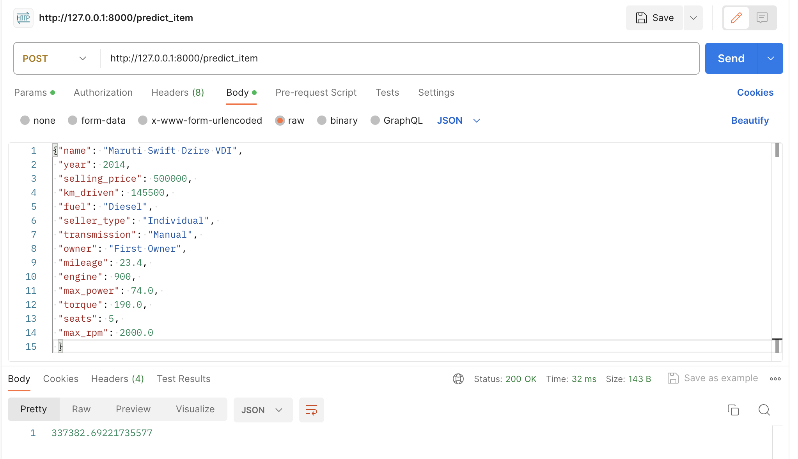
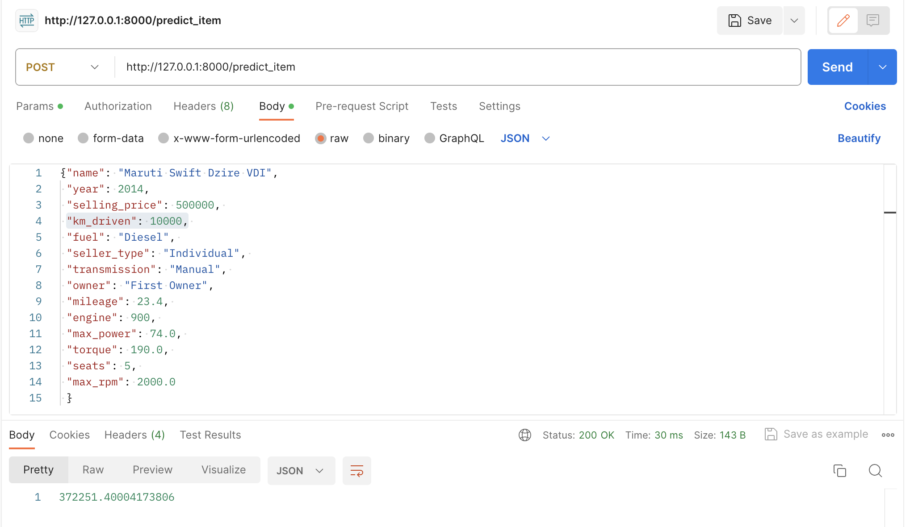
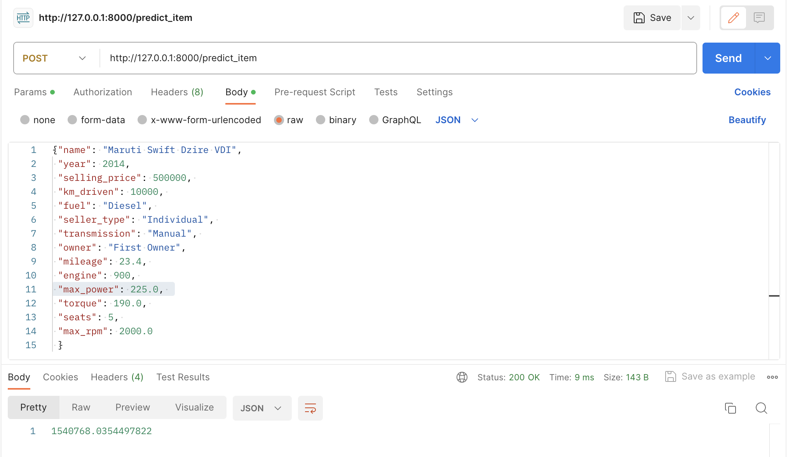

Домашнее задание 1

### Что было сделано?

* Первичный препроцессинг данных
* Провел EDA - корреляция, самый 
* Потестил несколько вариантов регуляризации линейных моделей
* Использовал категориальные признаки
* Провел дополнительную аналитику исходя из которой предобработал признаки - исключил/заменил некоторые наблюдения

### Результаты
* Регуляризация не помогла в этой задаче
* Так как согласно теореме Г.М. необходима нормальность остатков, логарифмирование таргета дала самыф большой буст
* Было ~0.6R2 => ~0.87R2

### Что не сделал/не дало результаты
* Преобразовывал признаки с помощью IQR. Так как не все признаки распределены нормально, буста не дало. Пробовал заполнять медианой/средним, клиповать и исключать "плохие признаки"
* Не сделал перебор комбинаций всех признаков (включая фиктивные). Их слишком много, поэтому одна регрессия со всеми признаками переобучится. Оптималоьно было бы перебрать все признаки и проводить stepwise процедуру, но руки не дошли(
    
### Результаты работы сервиса
Посмотрим на пример входа:

Скрутим пробег - цена выросла на 40к

Поменяем двигатель на ракетный - цена выросла в 4 раза
